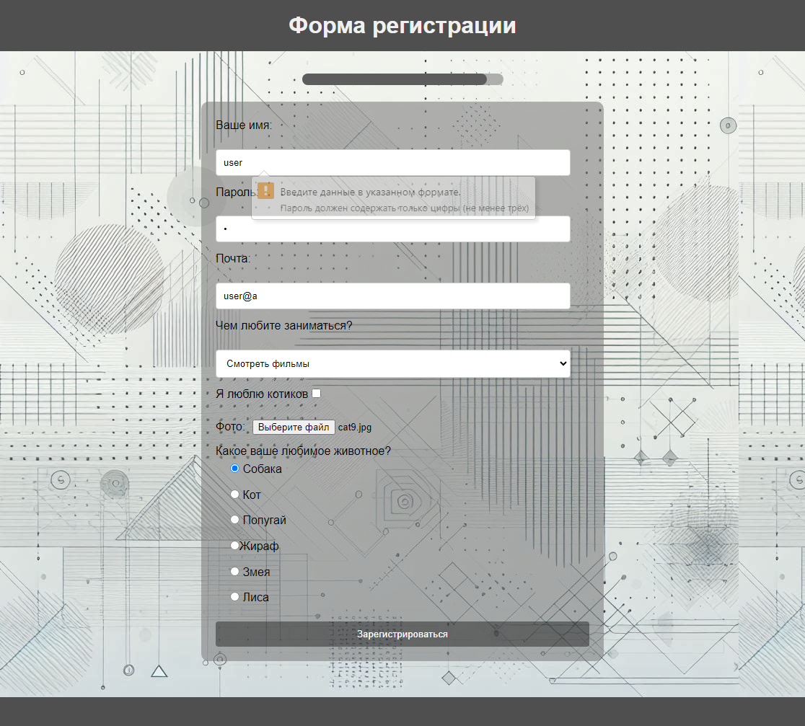
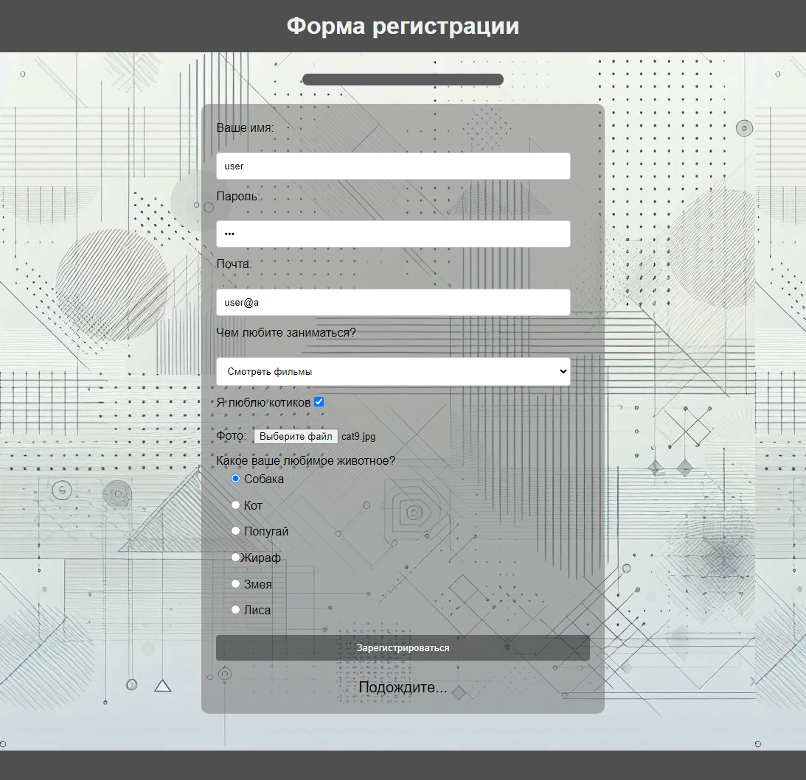
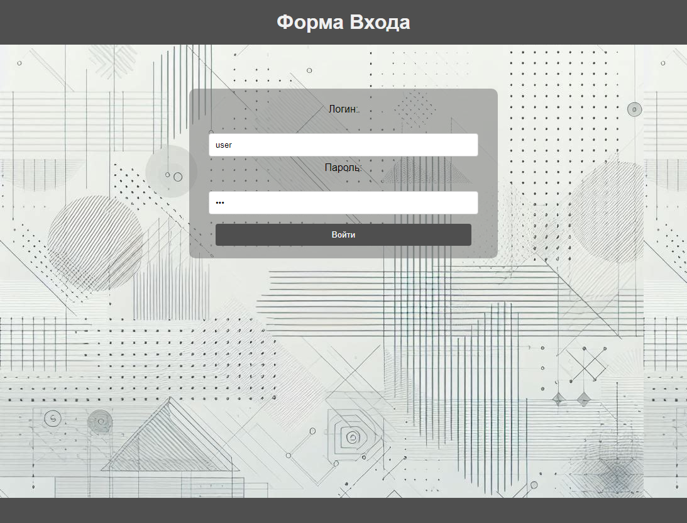
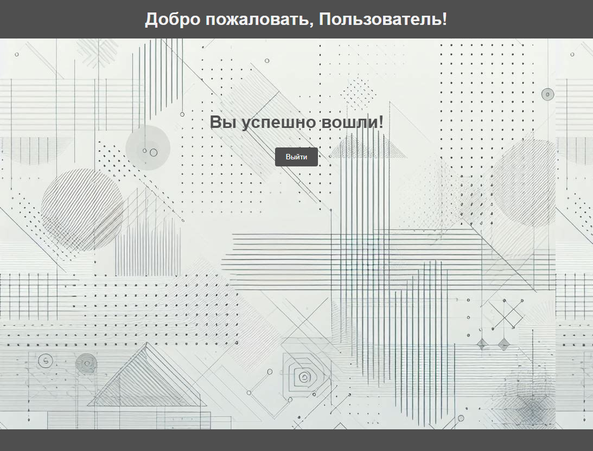

# [Авторизация и Регистрация Пользователей](https://asalferova.github.io/RegistrationForm/ "Ссылка на сайт")

## Описание проекта

Этот проект представляет собой систему авторизации и регистрации пользователей, написанную на чистом JavaScript. Он включает в себя валидацию формы, обработку ошибок, работу с LocalStorage и отправку данных на сервер.

   **Технологии**:         
   Fetch API,
   HTTPBin API.

   Основные функции:

   * **Регистрация**: Пользователи могут регистрироваться, вводя свои данные в форму. Эти данные затем сохраняются в **LocalStorage**.
   * **Авторизация**: Зарегистрированные пользователи могут входить в систему, вводя свои учетные данные. Система проверяет эти учетные данные, сравнивая их с данными, сохраненными в LocalStorage.
   * **Валидация формы**: Форма включает в себя валидацию на стороне клиента, которая проверяет, правильно ли заполнены поля формы, и наводит фокус на невалидные поля.
   * **Прогресс-бар**: Прогресс-бар отображает, насколько заполнена форма.
   * **Отправка данных на сервер**: После успешной валидации формы, происходит сериализация формы **(FormData)**, затем данные отправляются на сервер с помощью **fetch**. Используется **HTTPBin API**  для тестирования отправки данных, в процессе отправки работает **лоадер**, который просит пользователя подождать, в лучае успешной отправки, происходит переход на страницу входа, иначе пользователь оповещается об ошибке.
   * **Вход**: Пользователь вводит логин и пароль введенные на странице регистрации, и, если данные совпадают, происходит перенаправление на страницу приветствия, где присутствует небольшая **анимация**.

Этот проект демонстрирует навыки работы с формами, валидацией данных, отправкой данных на сервер, а также работой с  localStorage  для хранения пользовательских данных.  Для отправки данных на сервет используются объект FormData и метод POST.

## Скриншоты сайта

Здесь представлены скриншоты сайта:

1. Валидация формы + прогесс-бар
 

2. Отправка данных на сервер, лоадер

3. Страница входа

4. Страница приветствия

